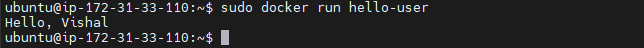

# Basic-Dockerfile
Build a basic Dockerfile to create a Docker image

### Steps
- Installed docker in my ubuntu server
- Then, created a Dockerfile that prints "Hello, Captain" in the console.

```bash
# Dockerfile
FROM alpine:latest
ENTRYPOINT ["echo", "Hello, Captain"]
```
- Next, built the image using following command.

```bash
sudo docker build -t hello-captain .
```
- In above command -t means tag I gave image tag as hello-captain. And ensure the Dockerfile should be in current directory then only the above command build docker images. If you have your dockerfile in other location remove the "." and enter the path in there.
- Furthermore, created container using following command.

```bash
sudo docker run hello-captain
```

- **Output**


- After, to print the name instead of Captain. I did the following changes in the dockerfile.

```bash
# Dockerfile
FROM alpine:latest
ARG user_name
COPY --chmod=755 <<EOT /print.sh
#!/bin/sh
echo "Hello, "$user_name
EOT
ENTRYPOINT ["/print.sh"]
```
- Then, pass my name as an argument using following command.

```bash
sudo docker build --build-arg user_name="Vishal" -t hello-user .
```
- Next, created container using following command.

```bash
sudo docker run hello-user
```

- **Output**


### Project Description URL
https://roadmap.sh/projects/basic-dockerfile


**Docker Installation Doc link for ubuntu**: https://docs.docker.com/engine/install/ubuntu/